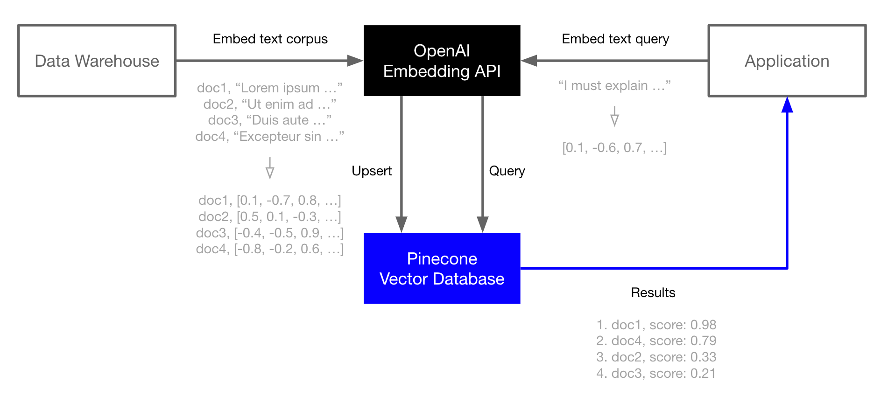

# OpenAI Embeddings search using Pinecone database.

This project demonstrates how to use OpenAI embeddings search using pinecone database and adds zero shot classification 
sentiments to indexes.

# Getting started

1) Get OpenAI API key and Pinecone API Key. Add them to the config.toml
2) Pipenv install
3) Add csv file in the root and hit the endpoint /load_data?file=your_file_name.csv (this assumes csv file has a column
   named "text", this is the column we are indexing.). file_name defaults to sample.csv file; which is included
4) Hit / will take you to search form and you can search what you have indexed.

# How it works

It reads data from csv file and creates embeddings vectors using OpenAI APIs, runs cosine_similarity on it to 
figure out either positive or negative and stores it in Pinecone index. And to search it creates embedding vectors 
using OpenAI APIs and queries Pinecone index. Search query is moderated and is configured to return to 5 search results. 

